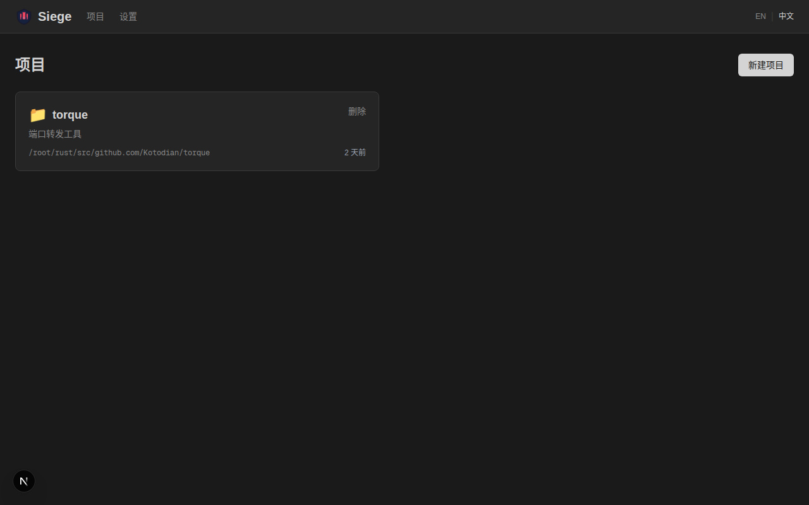
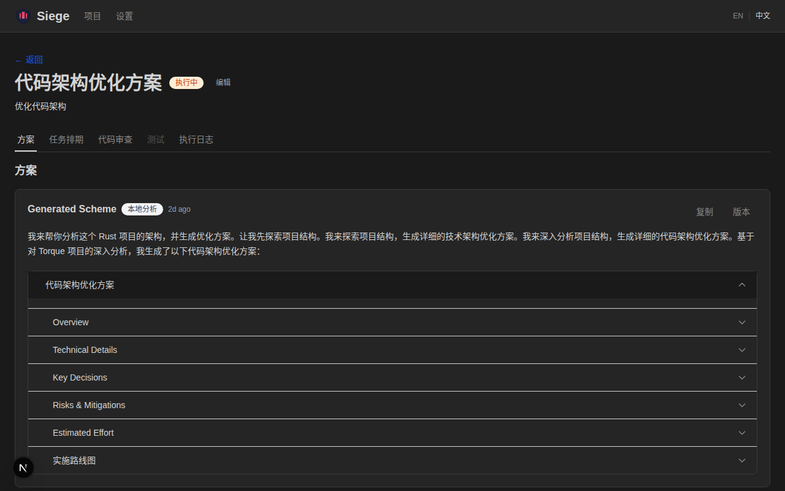
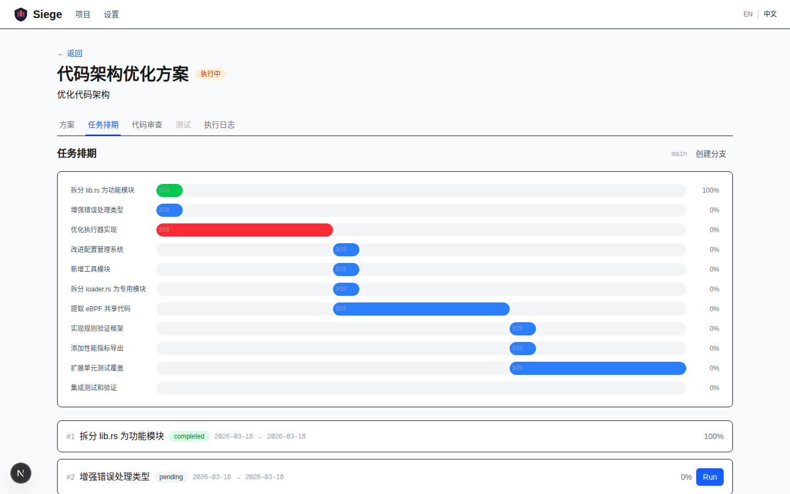
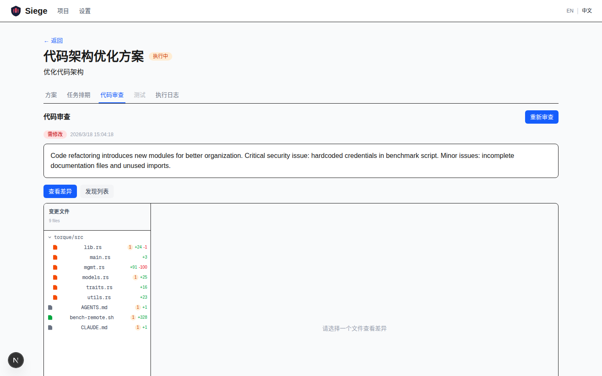
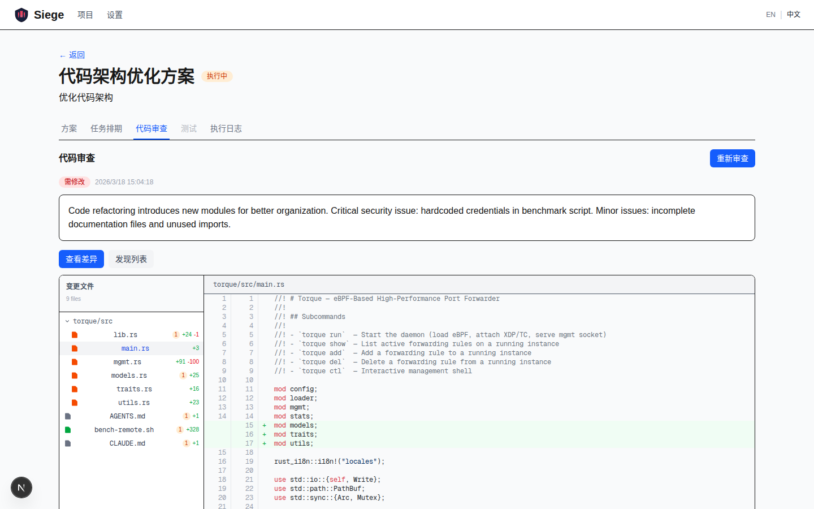
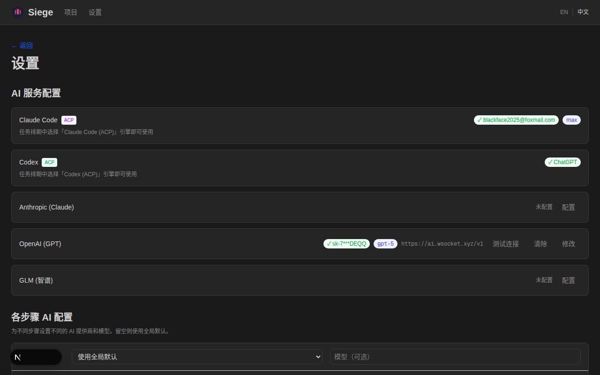
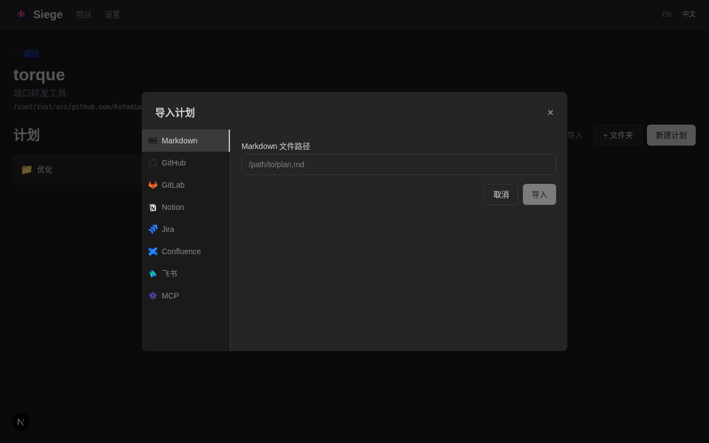
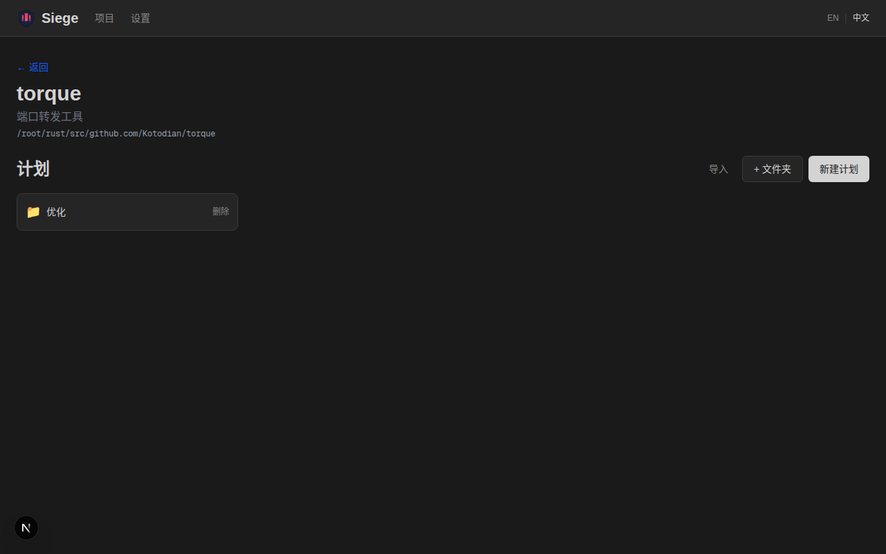

<p align="center">
  <h1 align="center">Siege</h1>
  <p align="center">
    AI 驱动的智能开发工具
    <br />
    <a href="README.md">English</a>
    <br />
    <em>从设计到实现，一站式完成。</em>
  </p>
</p>

<p align="center">
  
  
  
  
  
</p>

---

## 为什么选择 Siege？

### 直接使用 Claude Code / Codex 的痛点

如果你一直在用 Claude Code 或 Codex CLI 做真实项目，大概率遇到过这些问题：

| 痛点 | 描述 |
|------|------|
| **没有项目连续性** | 每次对话都从零开始。上次规划了什么、写了什么、审查了什么，全部丢失。 |
| **没有结构化流程** | 从"想法"直接跳到"写代码"，中间没有技术设计、没有任务拆解、没有审查环节。 |
| **进度不可见** | 没有面板、没有时间线、无法看到哪些做完了哪些还没开始。全靠脑子记。 |
| **没有代码审查** | AI 写完代码就合并。没有 diff 视图、没有行内标注、没有质量关卡。 |
| **一次性执行** | 大任务容易失败或产出不完整，因为没有办法拆成多个有上下文传递的小步骤。 |
| **没有测试生成** | 实现完成后，测试全靠手写。没有基于实际代码变更的 AI 测试用例生成。 |
| **只有终端界面** | 一切都在终端里。没有可视化排期、没有甘特图、没有可点击的管理界面。 |

### Siege 如何解决这些问题

Siege 将 Claude Code / Codex 包装成一个**完整的开发生命周期管理器**，配合可视化 UI：

```
 计划  →  方案  →  排期  →  执行  →  审查  →  测试
  │        │       │        │        │       │
 描述     AI生成   甘特图   Claude   Diff视图  AI生成
 +标签   +编辑    时间线   Code/Codex +标注   +运行
```

- **持久化上下文** — 项目、计划、方案、执行日志全部存储在 SQLite。随时继续上次的工作。
- **结构化设计** — AI 先生成技术方案，审查通过后再写代码。支持对话式修改方案。
- **可视化任务排期** — AI 将工作拆解为有序任务，以甘特图展示。按小时粒度排期，支持定时自动执行。
- **GitHub PR 风格代码审查** — 查看真实 `git diff`，带语法高亮、文件树导航、行内 AI 发现标注、一键 AI 修复。
- **AI 驱动测试** — 基于实际实现自动生成并运行测试用例。
- **多 AI 提供商** — 支持 Anthropic (Claude)、OpenAI (GPT)、GLM (智谱)。支持 API Key、代理中转、Claude 订阅登录。

---

## 截图

<table>
  <tr>
    <td><br /><em>项目列表</em></td>
    <td><br /><em>AI 生成的技术方案（手风琴分段展示）</em></td>
  </tr>
  <tr>
    <td><br /><em>甘特图任务排期</em></td>
    <td><br /><em>代码审查 — 文件树 & Diff 视图</em></td>
  </tr>
  <tr>
    <td><br /><em>语法高亮 Diff 及行内发现标注</em></td>
    <td><br /><em>AI 提供商 & 各步骤模型配置</em></td>
  </tr>
  <tr>
    <td><br /><em>多来源导入 — GitHub、GitLab、Notion、Jira、Confluence、飞书、MCP</em></td>
    <td><br /><em>计划列表与文件夹</em></td>
  </tr>
</table>

## 核心流程

**1. 创建项目** — 选择本地仓库或从 GitHub 克隆。AI 自动检测 `CLAUDE.md` 获取项目上下文。

**2. 创建计划** — 描述你想要构建的内容。AI 自动生成标题。支持文件夹整理、标签分类（功能/缺陷/重构等）。

**3. 生成方案** — AI 搜索网络并分析本地代码，生成技术方案。支持编辑、审查、对话式修改。

**4. 生成排期** — AI 将确认的方案拆解为可执行任务，以甘特图展示时间线。按小时粒度排期，支持手动调整。

**5. 执行** — 通过 Claude Code 或 Codex CLI 执行任务，支持 SSE 实时进度流。每个任务继承前序任务的上下文。支持定时自动执行。

**6. 代码审查** — 查看 `git diff` 语法高亮视图，文件树导航。AI 审查代码质量、安全性和正确性。发现标注精确到行，点击"AI 修复"一键修复。

**7. 测试** — AI 生成并运行测试用例验证实现。

## 功能特性

### AI 集成
- **多提供商**：Anthropic (Claude)、OpenAI (GPT)、GLM (智谱)
- **代理支持**：自定义 API 基础 URL
- **Claude 订阅登录**：无需 API Key，直接使用你的 Claude 订阅
- **会话复用**：同一计划内后续 AI 调用复用会话（约 10x 加速）
- **串行队列**：一次只运行一个 AI 任务，避免进程堆积

### 代码审查
- 带语法高亮的 **Git diff 查看器**（highlight.js）
- **文件树侧边栏**，可折叠目录，显示增删统计和发现计数
- **行内发现标注**，带严重性等级
- **行内评论**，AI 自动生成修复建议
- **一键"AI 修复"** — 直接将 AI 建议应用到文件

### 任务排期
- **按小时粒度**排期，甘特图时间线展示
- **支持编辑**排期时间
- **定时自动执行** — 开启后按排期时间自动触发任务执行

### 项目管理
- **文件夹层级**组织计划
- **标签**：功能、缺陷、增强、重构、文档、测试、杂务、性能
- 首页**最近打开**的项目
- 自定义**项目图标**

### 多来源导入
- **Markdown** — 从本地 `.md` 文件导入计划
- **Notion** — 搜索页面/数据库，blocks 自动转 markdown
- **Jira** — 通过 JQL 搜索 Epic/Story，子任务自动变方案
- **Confluence** — 通过 CQL 搜索页面，H2 分段变方案
- **飞书** — 搜索知识库文档，block 级别内容转换
- **GitHub Issues** — 按仓库或全局搜索 issues，label 自动映射计划标签
- **GitLab Issues** — 支持自建实例，按项目或全局搜索
- **MCP 服务器** — 连接任意 MCP 服务器，导入 resources 为计划
- **内联配置** — 直接在导入对话框中配置新来源，无需跳转设置页

### 数据管理
- **自动归档**已完成计划
- **备份**至本地文件系统、Obsidian 库或 Notion
- **SQLite** — 零运维，单文件数据库

### 国际化
- 完整的中英文支持
- 所有 UI 标签、状态徽章、提示信息均已翻译

## 快速开始

```bash
# 克隆
git clone https://github.com/Kotodian/siege.git
cd siege

# 安装
npm install

# 启动
npm run dev
```

打开 [http://localhost:3000](http://localhost:3000) — 引导页会带你完成 GitHub 连接、AI 配置和创建第一个项目。

### 前置条件

- **Node.js** 20+
- **Claude Code** (`claude` CLI) — 用于无 API Key 的 AI 功能
- **GitHub CLI** (`gh`) — 可选，用于 GitHub 仓库集成

### AI 配置

Siege 支持三种 AI 接入方式：

| 方式 | 速度 | 配置 |
|------|------|------|
| **API Key** | 快（流式） | 从提供商控制台获取密钥 |
| **代理/中转** | 快 | 自定义基础 URL + 密钥 |
| **Claude 登录** | 约 1-2 分钟/次 | 只需 `claude login`，无需密钥 |

在**设置**页面或引导流程中配置。

## 技术栈

| 层 | 技术 |
|---|------|
| 框架 | Next.js 16 (App Router) |
| 语言 | TypeScript |
| 数据库 | SQLite (Drizzle ORM + better-sqlite3) |
| 样式 | Tailwind CSS 4 |
| AI SDK | Vercel AI SDK + Claude/Codex CLI 回退 |
| 国际化 | next-intl |
| 语法高亮 | highlight.js |
| Markdown | react-markdown + rehype-highlight |
| 图表 | frappe-gantt |
| 测试 | Vitest |

## 开发

```bash
# 运行测试
npm test

# 监听模式
npm run test:watch

# 构建
npm run build

# Schema 变更后生成迁移
npx drizzle-kit generate
```

## 许可证

MIT
